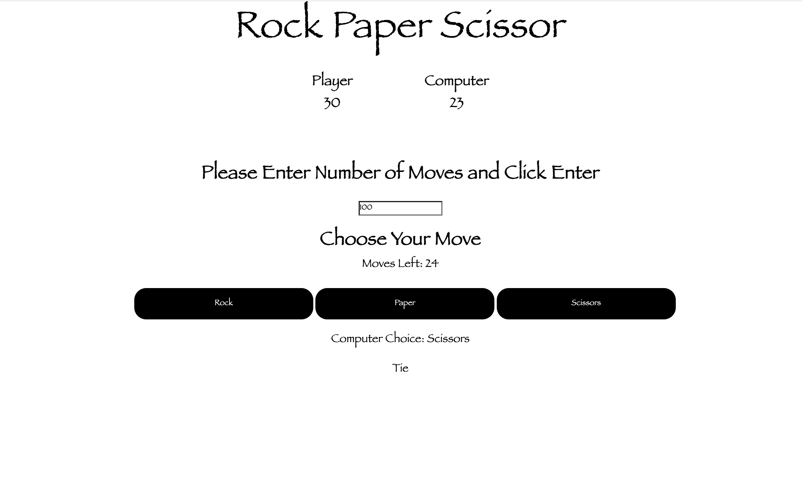

# Task1-GSOC
This is the first task of the GSOC CERN challenge. It simulates playing of the game Rock/Paper/Scissors between a human player and the computer for a total of n moves. The winner of a particular move is determined by the well-known game schema

- paper beats (wraps) rock
- rock beats (blunts) scissors
- scissors beats (cuts) paper

Application is currently deployed on the following link of [Heroku](https://blooming-plains-32847.herokuapp.com/)

